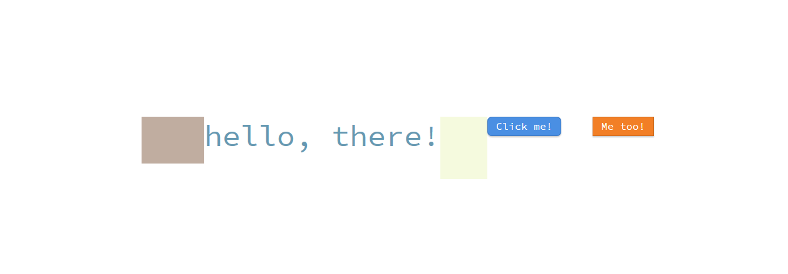

# cpp-gui

Disclaimer (archived exploration): This project is not meant to be used in any serious way. Feel free to get inspired, but keep in mind that I would probably do things differently now.


This is a reactive c++ gui "library".



Perhaps the most interesting "feature" is the use of virtual inheritance to implement widget composition:
```c++
// the simple button shall be:
// rounded (changes collision & draw behavior),
// solid (draws a solid (rounded) rectangle as the background),
// and have a shadow.
struct Simple_Button_Widget : virtual Base_Button_Widget, Rounded_Widget, Solid_Widget, Shadow_Widget {
    V4f base_fill_color;
    V4f base_stroke_color;
    // ...
};


// an example of composition:
void Simple_Button_Widget::on_paint(ID2D1RenderTarget* target) {
    // first do whatever we need to do.
    auto scale = 1.0f;
    if(this->hovered()) { scale *= 1.1f; }
    if(this->pressed()) { scale *= 1.1f; }

    this->fill_color   = V4f(scale * V3f(this->base_fill_color),   this->base_fill_color.a);
    this->stroke_color = V4f(scale * V3f(this->base_stroke_color), this->base_stroke_color.a);

    // then call the components.
    // we have control over the order,
    // which is important, because the shadow
    // needs to be at the bottom.
    Shadow_Widget::on_paint(target);
    Solid_Widget::on_paint(target);
    Single_Child_Widget::on_paint(target);
}
```


License: MIT. Any libraries used may of course have different licenses.
